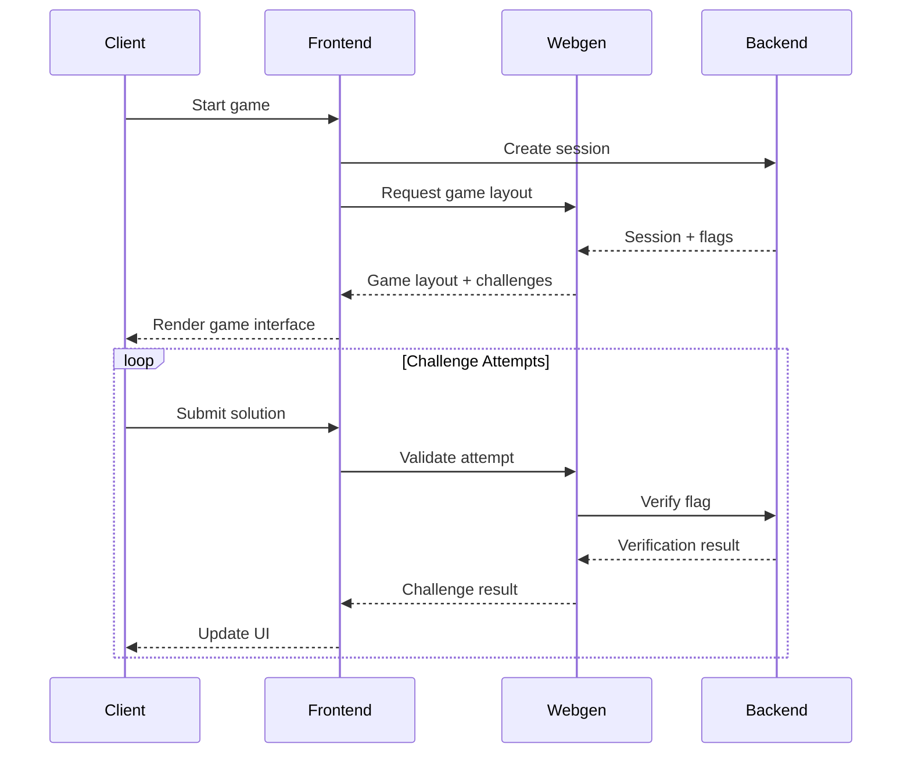

# System Flow

## Game Lifecycle

1. **Game Initialization**
   - Backend generates a new game session with unique flags
   - Webgen receives request for new game layout
   - Webgen selects template and challenges
   - Frontend receives game layout and challenge components
   - WebSocket connection established for real-time updates

2. **Challenge Setup**
   - Backend generates unique flags for each challenge
   - Flags are securely stored with challenge IDs
   - Webgen maps challenges to flag indices
   - Frontend renders challenge components

3. **Game Play**
   - Player interacts with challenge components
   - Challenge attempts validated by Webgen
   - Successful solutions verified by backend
   - Real-time progress updates via WebSocket
   - Score updates broadcast to all players

## Component Communication

## Challenge Flow

1. **Authentication Bypass**
   - Player attempts SQL injection
   - Webgen validates login attempt
   - Backend verifies success
   - Flag returned on successful bypass

2. **XSS Challenge**
   - Player inputs search query
   - Webgen processes search
   - XSS execution detected
   - Backend verifies and returns flag

3. **IDOR Challenge**
   - Player requests profile
   - Webgen validates access
   - Backend verifies unauthorized access
   - Flag returned on successful IDOR

4. **CSRF Challenge**
   - Player crafts CSRF request
   - Webgen validates request origin
   - Backend verifies CSRF success
   - Flag returned on successful CSRF

## Flag System

1. **Generation**
   - Backend creates unique flags per game session
   - Flags mapped to specific challenge IDs
   - Secure storage in backend memory
   - No persistence between sessions

2. **Validation**
   - Webgen handles initial challenge validation
   - Backend performs final flag verification
   - Multi-step verification process
   - Real-time validation results

3. **Security Measures**
   - Flags never stored in client
   - Backend maintains secure flag mapping
   - Session-specific flag generation
   - Rate limiting on verification attempts
   - Encrypted communication channels

## Real-time Updates

1. **WebSocket Integration**
   - Persistent connection for live updates
   - Score and progress broadcasting
   - Challenge state synchronization
   - Player status updates

2. **State Management**
   - Backend as source of truth
   - Frontend state synchronization
   - Real-time leaderboard updates
   - Challenge completion tracking

3. **Error Handling**
   - Graceful connection recovery
   - State resynchronization
   - Error message propagation
   - Automatic reconnection logic