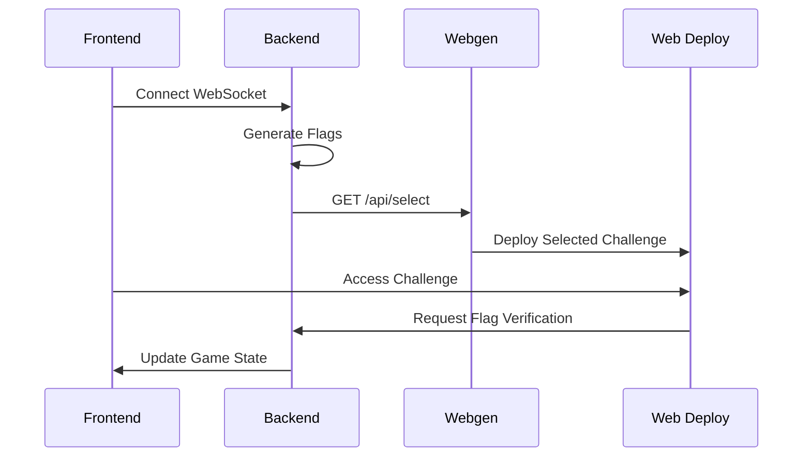

# System Flow

## Game Lifecycle

1. **Initialization**
   - User connects to frontend
   - Frontend establishes WebSocket connection with backend
   - Backend creates user session

2. **Lobby Creation**
   - Backend generates flags using UUID
   - Backend sends GET request to Webgen's /api/select

3. **Challenge Selection**
   - Webgen chooses a problem from available options
   - Selected problem is deployed to web-deploy

4. **Game Play**
   - Players access challenge through web-deploy
   - Players attempt to solve the challenge
   - Successful solutions trigger flag requests to backend
   - Backend verifies flags and updates scores

## Component Communication

