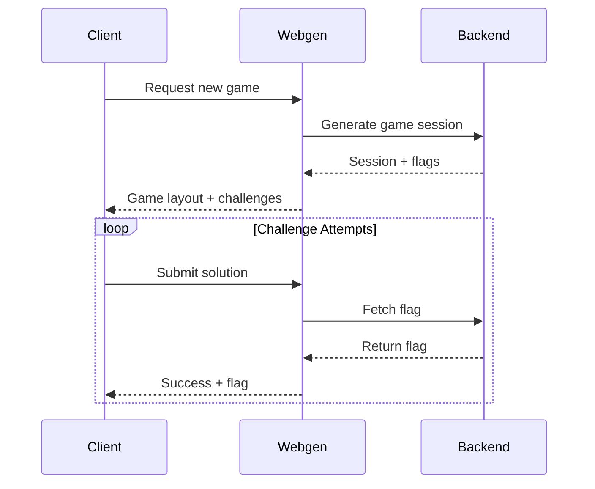

# System Flow

## Game Lifecycle

1. **Game Initialization**
   - Backend generates a new game session
   - Webgen receives request for new game
   - Webgen selects template and challenges
   - Client receives game layout and challenge components

2. **Challenge Setup**
   - Backend generates flags for each challenge
   - Flags are stored with challenge IDs
   - Webgen maps challenge IDs to flag indices

3. **Game Play**
   - Player interacts with challenge components
   - Challenge attempts sent to webgen endpoints
   - Successful solutions receive flags from backend
   - Progress tracked per challenge

## Component Communication

## Challenge Flow

1. **Authentication Bypass**
   - Player attempts SQL injection
   - Webgen validates login attempt
   - Success returns flag from backend

2. **XSS Challenge**
   - Player inputs search query
   - Webgen processes search
   - XSS execution triggers flag

3. **IDOR Challenge**
   - Player requests profile
   - Webgen validates access
   - Unauthorized access returns flag

4. **CSRF Challenge**
   - Player crafts CSRF request
   - Webgen validates request origin
   - Successful CSRF returns flag

## Flag System

1. **Generation**
   - Backend creates unique flags per game
   - Flags mapped to challenge IDs
   - Flags stored for session duration

2. **Validation**
   - Webgen requests flags from backend
   - Backend validates challenge completion
   - Flags returned only on success

3. **Security**
   - Flags never stored in client
   - Backend maintains flag-challenge mapping
   - Each flag unique per session